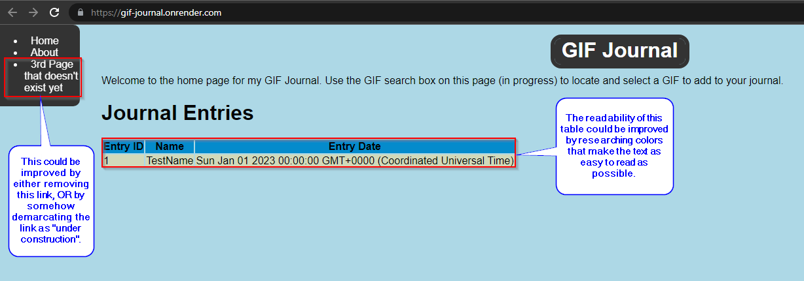

# GIF Journal Heuristic Improvements

Author: jgreen41
--------

Aesthetic And Minimalist Design
========
The 'Aesthetic And Minimalist Design' heuristic is relevant for my project at this time, as the color scheme for my website could be improved from a readability standpoint. This is an issue for Index.html, since the table rows are currently composed of colors that somewhat clash. I allowed my wife to navigate through my website, and this was the first thing that she struggled with. A change like this would increase the usability of the website, even though I would be technically removing something. Since the link is not helpful at this time, the website would become slightly more efficient to operate as a user.

Flexibility And Efficiency Of Use
========
The other relevant heuristic is Flexibility And Efficiency Of Use. My wife also pointed out that I currently have a "dead link" in my nav tree, which is a placeholder for a 3rd webpage in case I find that I need to include one. This heuristic could be improved if I were to either remove the link completely until it has been fully implemented, or I could signify that the link is currently under construction so that the user doesn't have to waste time by clicking on it before discovering that the link is not useful at this time. A change like this would increase the usability of the website.

